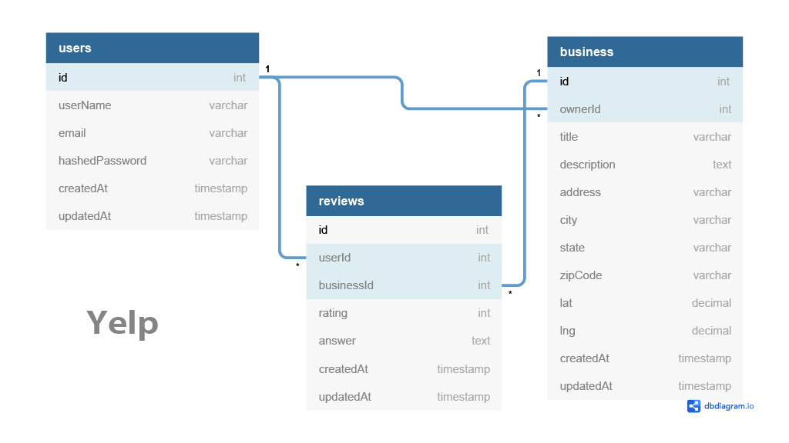

# Welcome to Kelp

## About

Kelp is an application to view and review kelp-related businesses. Users are able to add, update, and remove businesses from the directory, as well as add and delete reviews.

## Running your own

### Development

1. Clone the repo
```
git clone https://github.com/samuelrkramer/Kelp.git
```

2. Copy the **.env.example** file and change to your proper settings

3. Setup your Postgres user with `CREATEDB` according to your **.env** settings

4. Install node dependencies in **BOTH** the `backend` and `frontend` directories:
```
npm install && npm install -D
```

5. Run startup scripts in **BOTH** the `backend` and `frontend` directories:
```
npm start
```

## DB Schema
